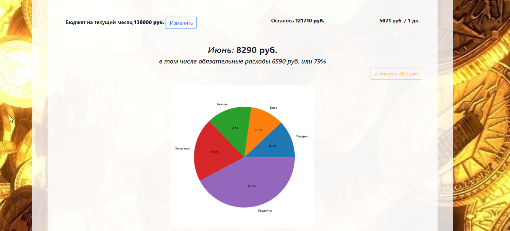
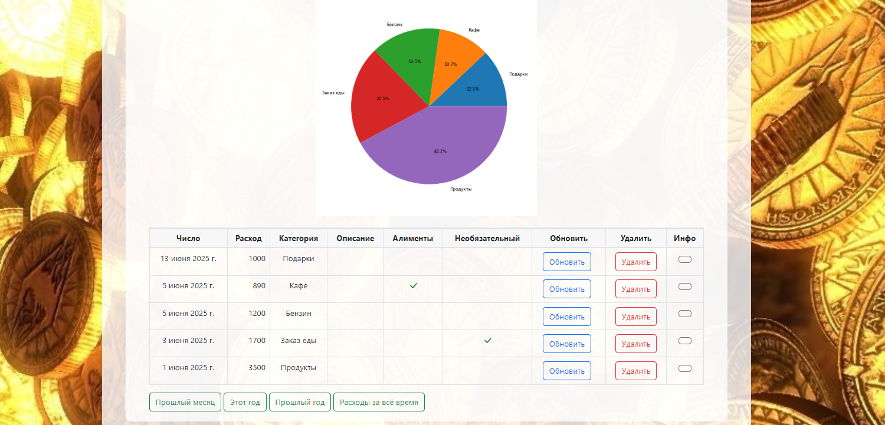
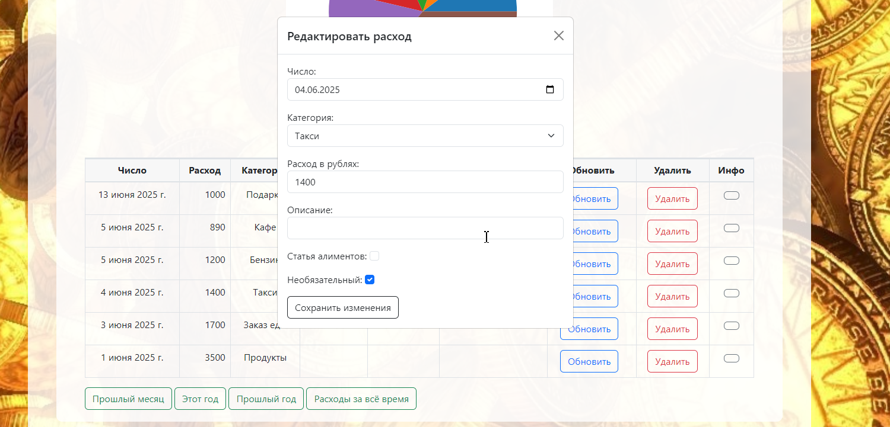
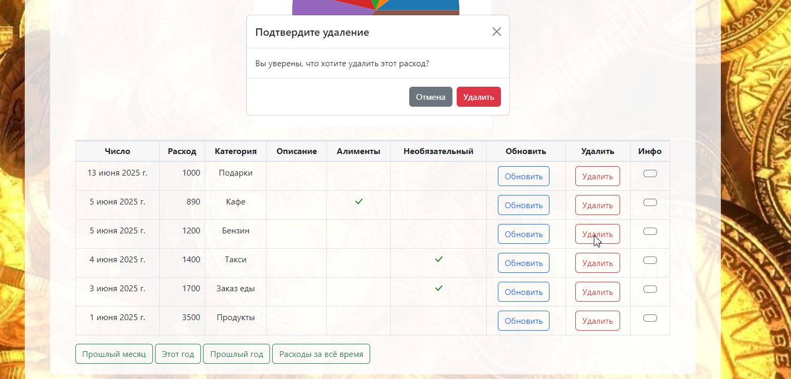
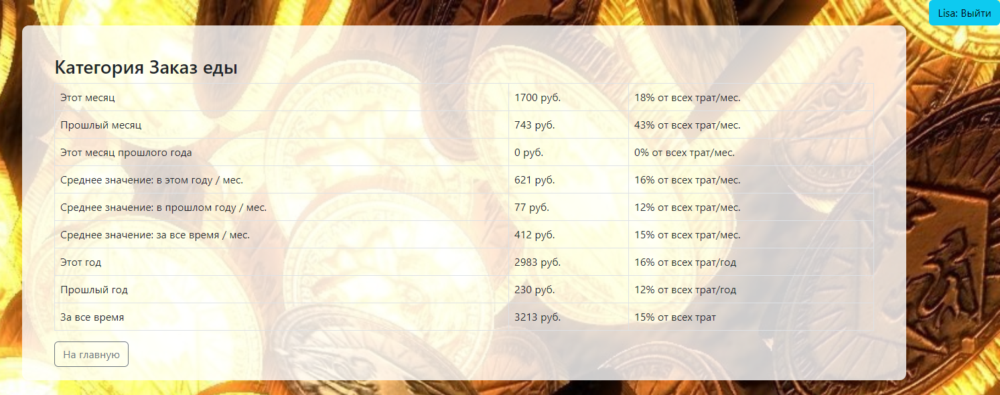
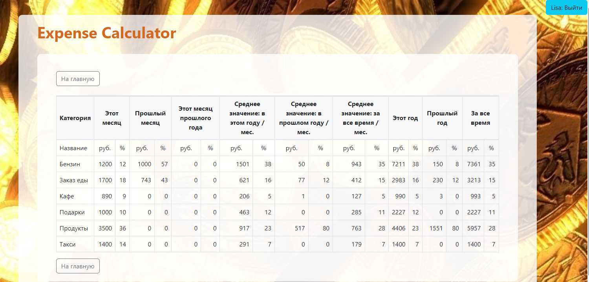
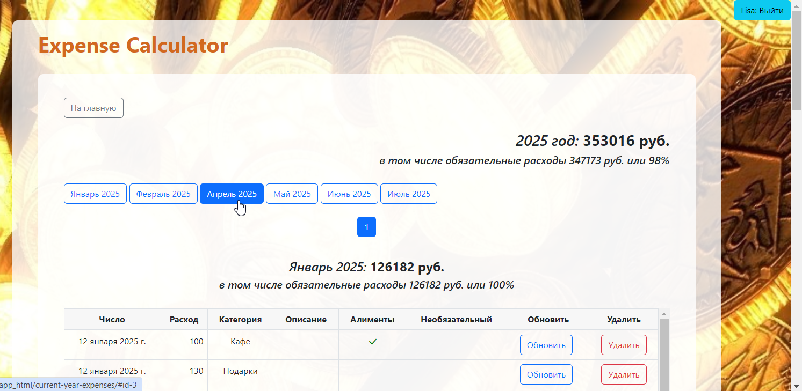

# Expense Calculator Pet Project 2025
### Description
A Django-based web application for tracking and analyzing personal financial expenses. Add, edit, and delete your expenses. Categorize spending for better organization. Group expenses by various time periods. Set and monitor monthly budgets. Visual analytics with charts and tables. Secure — each authenticated user has access only to their own data. Clean and user-friendly interface. 
This app helps users gain insights into their financial habits and make informed budgeting decisions.

### Quick start via Docker

```bash
git clone https://github.com/yourusername/expense_calculator_pet_project_2025.git
cd expense_calculator_pet_project_2025
cp example.env .env
docker-compose up --build
docker-compose exec web python manage.py migrate
docker-compose exec web python manage.py createsuperuser
```
Enjoy!

### Api Documentation
    • Swagger: http://localhost:8000/swagger/
    • Redoc: http://localhost:8000/redoc/

### Features
    • User registration & authentication: out-of-the-box with Django and Djoser API
    • Security: Users have access only to their own expenses & categories — no cross-user visibility    
    • Django admin panel for managing data at http://localhost:8000/admin/
    • Fully documented REST API
    • Data storage using PostgreSQL
    • Built-in pgAdmin interface for managing the database at http://localhost:5050
    • Admin panel at http://localhost:8000/admin/
    • Frontend styled with CSS and Bootstrap

### Pages









